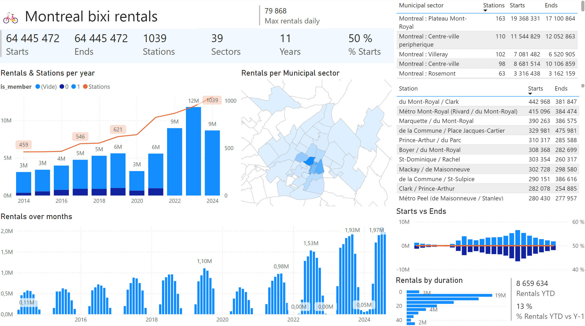
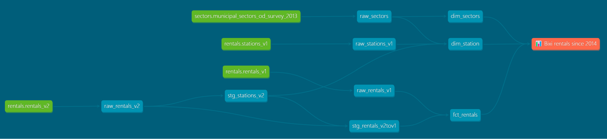
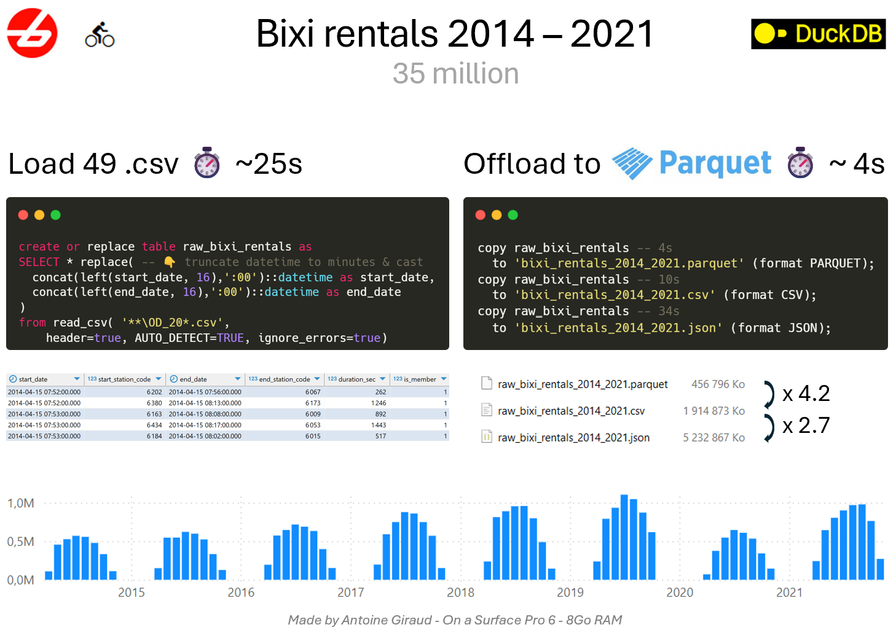

# Bixi's OpenData Modelisation

Here is a [dbt-core](https://github.com/dbt-labs/dbt-core) project that loads & transform [bixi OpenData](https://bixi.com/fr/donnees-ouvertes/) thanks to [DuckDB](https://duckdb.org/) 🦆🚀

### Viz' exploration

I used Power BI to explore the transformed data offloaded to `.parquet` *(~ 4.7 times lighter than `.csv`)*

After the pandemic, Montrealers realy went back to bixi 🥳



## Data sources

### Bixi Rentals OpenData ([link](https://bixi.com/fr/donnees-ouvertes/))

- 🚲 **Rentals V1** : from 2014 to 2021
  > for station info, join to station
      yearly file with station_code
- ⛽ **Stations V1** : from 2014 to 2021
  > 1 station code per year
- 🚲 **Rentals V2** : from 2022 to 2024+
  > start/end station info on each rentals\
  *-> 2.7 times heavier `.csv`* 1.4Gb -> 0.5Gb\
  *-> 2.3 times heavier `.parquet` 250Mb -> 106Mb*

### GIS referential

- 🧭 **Municipal sectors** : from the OD 2013 survey (cf. [donnees quebec](https://www.donneesquebec.ca/recherche/dataset/artm-secteurs-municipaux-od13/resource/95ab084b-727e-4322-9433-0fed7baa690d))

### GBFS scrapping (one day)

> GBFS means *General Bikeshare Feed Specification*, it's a standardized data feed for shared mobility system availability (cf. [Github > MobilityData/gbfs](https://github.com/MobilityData/gbfs))

#### Max Halford's GBFS scrapping

Max Halford launch a web scrapping on 76 bikeshares around the globe at summer 2023. (cf. it's [bike sharing forecasting training set](https://maxhalford.github.io/blog/bike-sharing-forecasting-training-set/) article)
Montréal was added at the end of spring.

To be added to rework & explore those bixi's station avalability overtime

```sql
-- example fetch toulouse station_status 🦆
SET s3_endpoint='storage.googleapis.com';
FROM READ_PARQUET('s3://bike-sharing-history/toulouse/**/*.parquet');
```

## Schema/DB steps :

- **raw** : raw tables loaded as is from .csv
- **stg** : intermediate tables
- **dtm** : tables ready for analytics & reporting use



if needed : 🖼 [DBeaver MLD](./dbeaver_table_mld.png)

### Loading

DuckDB realy shines by it's speed & local OLAP capabilities 😎

Here is 🚲 v1 rentals (2014 - 2021) load & offload to .parquet
- `.csv` is **4.5** times heavier than `.parquet`
- `.json` is **2.7** times heavier than `.csv`



## Resources

### Outils

- [**dbt-core**](https://github.com/dbt-labs/dbt-core) enables data analysts and engineers to transform their data using the same practices that software engineers use to build applications.\
  
- [**git**](https://git-scm.com/install/windows) *gestion de versions*
- [**VS Code**](https://code.visualstudio.com/) *éditeur de code*
  - [Power User for dbt](https://marketplace.visualstudio.com/items?itemName=innoverio.vscode-dbt-power-user)
  - [Git Graph](https://marketplace.visualstudio.com/items?itemName=mhutchie.git-graph)
- [**uv**](https://github.com/astral-sh/uv) extremely fast Python package & project manager, written in Rust.
- [**DuckDB**](https://duckdb.org/) analytical in-process SQL database
- [**DBeaver**](https://dbeaver.io/) Database Management Tool

### Se former à dbt & l'Analytics Engineering

- Suivre le tutoriel/badge [dbt-fundamentals](https://learn.getdbt.com/courses/dbt-fundamentals-vs-code)
- Consulter la [doc dbt](https://docs.getdbt.com/docs/introduction)
  ex:
  - [how we structure](https://docs.getdbt.com/best-practices/how-we-structure/1-guide-overview) our dbt projects
  - jouer avec le projet [jaffle-shop](https://github.com/dbt-labs/jaffle_shop_duckdb) ([guide](https://docs.getdbt.com/guides/duckdb?step=3))
- Alimenter sa veille & suivre sur LinkedIn
  - [Bruno Lima](https://www.linkedin.com/in/brunoszdl/) → partage bcp sur dbt
  - [Christophe Blefari](https://www.linkedin.com/in/christopheblefari/) → son regard critique sur la data ([newsletter](https://www.blef.fr/), [nao](https://getnao.io/))
  - [Robin Conquet](https://www.linkedin.com/in/robin-conquet-3a510292/) aka [DataGen](https://www.youtube.com/@data-gen) & ses podcast stratégie data
- Creuser plus loin
  - Faire les [autres eLearning dbt](https://learn.getdbt.com/courses)
  - Essayer un **quick start** dbt ?
  - lire [Continuous integration in dbt](https://docs.getdbt.com/docs/deploy/continuous-integration) → avancé
  - lire [Using defer in dbt](https://docs.getdbt.com/docs/cloud/about-cloud-develop-defer) → avancé

### Installation

#### Récupérer les outils

- [git](https://git-scm.com/install/windows) ou
  `winget install --id Git.Git -e --source winget`
  - Dire à **git** qui vous êtes
    ```shell
    git config --global user.name "PrenomNom"
    git config --global user.email votresuper@email.fr
    ```
- [uv](https://docs.astral.sh/uv/getting-started/installation/) ou
  `powershell -ExecutionPolicy ByPass -c "irm https://astral.sh/uv/install.ps1 | iex"`
- [DuckDB](https://duckdb.org/install/?platform=windows&environment=cli) ou `winget install DuckDB.cli`
- [DBeaver](https://dbeaver.io/download/) ou [windows store](https://apps.microsoft.com/detail/9pnkdr50694p?hl=fr-FR&gl=FR)
- [VS Code](https://code.visualstudio.com/Download) ou [windows store](https://apps.microsoft.com/detail/xp9khm4bk9fz7q?hl=fr-FR&gl=FR)

#### Clone & setup local du projet

- `git clone https://github.com/AntoineGiraud/dbt_bixi_opendata.git`
- `cd dbt_bixi_opendata` <em style="color: grey">se déplacer dans le dossier récupéré avec git</em>
- `uv sync`
  - télécharge **python** <em style="color: grey">si non présent</em>
  - initialise un environnement virtuel python (venv) <em style="color: grey">si non présent</em>
  - télécharge les dépendances / extensions python
- `.venv/Scripts/activate.ps1` (unix `source .venv/bin/activate`)\
  rendre **dbt** disponible dans le terminal
- `code .` ouvrir dans VS Code le répertoire courrant

### Commandes dbt importantes

| Commande | Rôle |
|----------|------|
| `dbt ls` | Liste les modèles |
| `dbt parse` | Vérifie syntaxe et validité |
| `dbt compile` | Génère SQL à partir des modèles |
| `dbt run` | Exécute les modèles (sans tests) |
| `dbt test` | Lance uniquement les tests |
| `dbt build` | Exécute modèles + tests |
| `dbt build -s +stg_commande+` | Construit `stg_commande` + parent & enfants |
| `dbt docs generate` | Génère la documentation |
| `dbt docs serve` | Lance un serveur web pour explorer doc & lineage |
