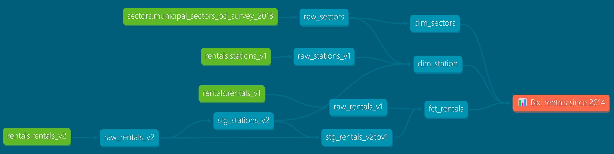

# Bixi's OpenData Modelisation

Here is a [dbt-core](https://github.com/dbt-labs/dbt-core) project that loads & transform [bixi OpenData](https://bixi.com/fr/donnees-ouvertes/) thanks to [DuckDB](https://duckdb.org/) 🦆🚀

### Viz' exploration

I used Power BI to explore the transformed data offloaded to `.parquet` *(~ 4.7 times lighter than `.csv`)*

After the pandemic, Montrealers realy went back to bixi 🥳


## Data sources

### Bixi Rentals OpenData ([link](https://bixi.com/fr/donnees-ouvertes/))

- 🚲 **Rentals V1** : from 2014 to 2021
  > for station info, join to station
      yearly file with station_code
- ⛽ **Stations V1** : from 2014 to 2021
  > 1 station code per year
- 🚲 **Rentals V2** : from 2022 to 2024+
  > start/end station info on each rentals\
  *-> 2.7 times heavier `.csv`* 1.4Gb -> 0.5Gb\
  *-> 2.3 times heavier `.parquet` 250Mb -> 106Mb*

### GIS referential

- 🧭 **Municipal sectors** : from the OD 2013 survey (cf. [donnees quebec](https://www.donneesquebec.ca/recherche/dataset/artm-secteurs-municipaux-od13/resource/95ab084b-727e-4322-9433-0fed7baa690d))

### GBFS scrapping (one day)

> GBFS means *General Bikeshare Feed Specification*, it's a standardized data feed for shared mobility system availability (cf. [Github > MobilityData/gbfs](https://github.com/MobilityData/gbfs))

#### Max Halford's GBFS scrapping

Max Halford launch a web scrapping on 76 bikeshares around the globe at summer 2023. (cf. it's [bike sharing forecasting training set](https://maxhalford.github.io/blog/bike-sharing-forecasting-training-set/) article)
Montréal was added at the end of spring.

To be added to rework & explore those bixi's station avalability overtime

```sql
-- example fetch toulouse station_status 🦆
SET s3_endpoint='storage.googleapis.com';
FROM READ_PARQUET('s3://bike-sharing-history/toulouse/**/*.parquet');
```

## Schema/DB steps :

- **raw** : raw tables loaded as is from .csv
- **stg** : intermediate tables
- **dtm** : tables ready for analytics & reporting use



### Loading

DuckDB realy shines by it's speed & local OLAP capabilities 😎

Here is 🚲 v1 rentals (2014 - 2021) load & offload to .parquet


- `.csv` is **4.5** times heavier than `.parquet`
- `.json` is **2.7** times heavier than `.csv`
